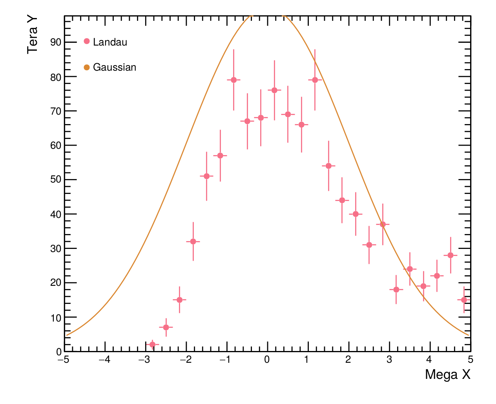

==========================
Roofie (Root Figures Easy)
==========================

The idea of roofie is to make plotting with root easier and less error prone. Root is certainly capable of producing good looking plot, but they do not come easy. Sometimes, one is even tempted to see malicious intent in some of root's behavior, but it is most likely just legacy which is to blame.

Anybody who ever did any plotting with root probably agrees with this part. But what does "roofie" do about it? For starters, its not a `C` macro! Instead it is written in python using the `pyroot`'s pythonaization `rootpy`. But on a more reflective note one should first ask what roofie is not: It is not an attempt to give the user the full customization capabilities of plain (py)root, nor is it trying to be fast or memory efficient. Rather it aims at making the "standard" figures easy to use in every aspect. If more is needed, "roofie" including the fallback possibility to export the TCanvas of a figure and do whatever you want with it on the pure-root level.

Features
--------
- Separation of data (histograms, functions, graphs,...) and presentation (design of the figure)
  One _figure_ consists of one or more _plottables_. Any setting regarding the visualization is done on the figure. The figure is, from the user's point of view, completely agnostic to which kind of "plottables" (e.g. TFunction or TH1) it is supposed to present. 
- Easy positioning of legend
- PDFs automagically fit their purpose. I.e., if a figure is supposed to go into a paper, no scalling needs to be applied and thus the font sizes are not out of proportion. This is done by setting the `style` of a figure object and roofie takes care of the font sizes and margins for you!
- Sensible default colors and an optional color pallet to be kind to people with deuteranomaly ("color blindness")

Examples
--------
In the end, an example might say more than a thousand words. Lets create a rather busy plot with graphs, histograms and functions and save it to a pdf file:

.. code-block:: python
		
    from ROOT import TF1
    from rootpy.plotting import Hist1D, Graph
    from roofie import Figure, Styles

    # Define the visuals of the figure:
    fig = Figure()
    fig.style = Styles.Public_full
    # Drawing the legend currently still screws up the y scale! :P
    # This is why we love root...
    fig.legend.title = "A legend title"
    fig.legend.position = 'tl'  # top left
    fig.xtitle = "Important X"
    fig.ytitle = "More important Y"

    # You can also pick a color palette.  The choices are "root", "set2",
    # "husl", and "colorblind"
    fig.plot.palette = "husl"

    # Define the "plottables" and add them to the figure
    f = TF1("f", "1000*exp(-0.5*((x)/2)**2)", -5, 5)
    g = Graph()
    g.SetPoint(0, 0, 100)
    g.SetPoint(1, 1, 200)
    g.SetPoint(2, 2, 200)
    fig.add_plottable(g, legend_title="A Graph")
    fig.add_plottable(f, legend_title='A Gaussian')

    # add_plottable makes a deep copy of the passed object so you can do whatever you want after its "commited" to the figure.
    # ie. overwrite a histogram in a loop:
    fig.add_plottable(None, legend_title="Many Landaus:")
    for i in range(1, 5):
        h = Hist1D(30, -5, 5)
        h.FillRandom('landau', 10000 * i)
        fig.add_plottable(h, legend_title="Landau {}".format(i), markerstyle='diamond')
    

    fig.save_to_file(path=".", name="busy_plot.pdf")

	   
If you want more examples you should take a look into the `tests`. 
