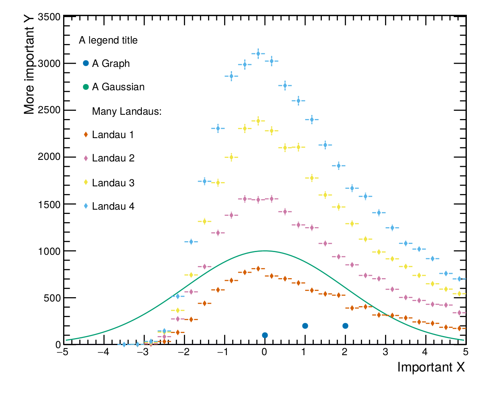

==========================
Roofie (Root Figures Easy)
==========================

The idea of roofie is to make plotting with root easier and less error prone. Root is certainly capable of producing good looking plot, but they do not come easy. Sometimes, one is even tempted to see malicious intent in some of root's behavior, but it is most likely just legacy which is to blame.

Anybody who ever did any plotting with root probably agrees with this part. But what does roofie about it? For starters, its not a `C` macro! Instead it is written in python using the `pyroot` pythonaization `rootpy`. But on a more reflective note one should first ask what roofie is not: It is not an attempt to give the user the full customization capabilities of play (py)root, nor is it trying to be fast or memory efficient. Rather it aims at making the "standard" figures easy to use in every aspect, including the fallback possibility to export the TCanvas of a figure and do whatever you want with it.

Features
--------
- Separation of data (histograms, functions, graphs,...) and presentation (design of the figure)
  One _figure_ consists of one or more _plottables_. Any setting regarding the visualization is done on the figure. The figure is, for the user point of view, completely agnostic to which kind of "plottables" it is supposed to present. 
- Easy positioning of legend
- Output PDFs automagically fit their purpose without any scaling having exactly the right font size
  Thats right, never look like a fool again trying to putting a figure with labels of font size 20 into your paper or font size 5 into your presentation. Set the `style` of the figure object and roofie takes care of the font sizes and margins for you!
- Sensible default colors and an optional color pallet to be kind to people with deuteranomaly (green-weak)

Examples
--------
In the end, an example might say more than a thousand words. Lets create a busy plot with graphs, histograms and functions and save it to a pdf file:

.. code-block:: python

    from ROOT import TF1
    from rootpy.plotting import Hist1D
    from roofie import Figure, Styles
    
    h = Hist1D(30, -5, 5)
    h.FillRandom('landau', 1000)
    
    f = TF1("f", "100*exp(-0.5*((x)/2)**2)", -5, 5)
    
    fig = Figure()
    fig.style = Styles.Public_full
    # Drawing the legend currently still screws up the y scale! :P
    # This is why we love root...
    fig.legend.title = "Functions"
    fig.legend.position = 'tr'  # top right
    fig.xtitle = "Mega X"
    fig.ytitle = "Tera Y"
    
    fig.add_plottable(h, legend_title="Landau")
    fig.add_plottable(f, legend_title='Gaussian')
    fig.save_to_file(path=".", name="busy_plot.pdf")

	   
If you want more examples you should take a look into the tests. 
